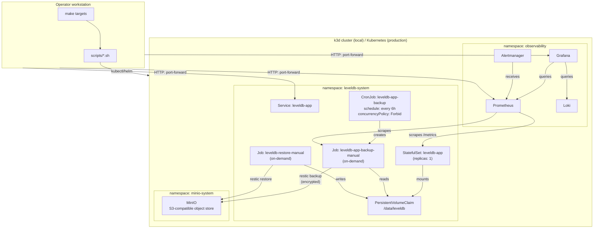

# Architecture

This document describes the system design of `stateful-k8s-recovery-lab`, explains the component relationships, and captures the rationale for major structural decisions.

---

## System overview

The system consists of four layers:

1. **Application layer** — a Go HTTP key-value service backed by embedded LevelDB storage, deployed as a Kubernetes `StatefulSet`
2. **Backup layer** — a Restic-based backup `CronJob` that writes encrypted snapshots to MinIO
3. **Observability layer** — Prometheus, Grafana, Alertmanager, and Loki
4. **Operator layer** — a Makefile and shell scripts that drive the entire lifecycle

---

## Component inventory

| Component | Namespace / Location | Type | Purpose |
|---|---|---|---|
| `leveldb-app` | `leveldb-system` | Go HTTP service | API-only key-value app backed by LevelDB |
| `leveldb-app` | `leveldb-system` | StatefulSet | Runs the single active writer pod for the LevelDB dataset |
| `data-leveldb-app-0` | `leveldb-system` | PVC | Stores `/data/leveldb` for the app pod |
| `leveldb-app` | `leveldb-system` | Service | Stable in-cluster endpoint for the app API |
| `leveldb-app-backup` | `leveldb-system` | CronJob | Runs Restic backup every six hours |
| `leveldb-app-backup-manual-*` | `leveldb-system` | Job | One-off backup created by `make backup` from the CronJob spec |
| `leveldb-restore-manual-*` | `leveldb-system` | Job | One-off restore job created by `make restore` |
| `leveldb-app-restic` | `leveldb-system` | Secret | Stores local-demo Restic and MinIO credentials |
| `minio` | `minio-system` | Helm release / Deployment | Local S3-compatible object storage for the POC |
| `restic` bucket | MinIO | Object bucket | Stores encrypted Restic repository data |
| `kube-prometheus-stack` | `observability` | Helm release | Installs Prometheus, Grafana, Alertmanager, and CRDs |
| `loki` | `observability` | Helm release | Stores Kubernetes logs |
| `alloy` | `observability` | Helm release | Collects pod logs and sends them to Loki |
| `ServiceMonitor` | `leveldb-system` | Prometheus Operator CRD | Tells Prometheus to scrape `/metrics` from the app |
| `PrometheusRule` | `leveldb-system` | Prometheus Operator CRD | Defines app and backup alerts |
| `Makefile` | repo root | Operator interface | Human-friendly command entry point |
| `scripts/*.sh` | repo root | Shell automation | Idempotent lifecycle, deploy, backup, restore, and diagnostics |
| `helm-values/*` | repo root | Helm values | Local values for MinIO, Prometheus stack, Loki, and Alloy |

---

## Architecture diagram



---

## Components

### Go application (leveldb-app)

A minimal Go HTTP service. It exposes a key-value API backed by LevelDB. There is no query language, no authentication, and no network replication—deliberately, to keep the operational model simple.

LevelDB is an embedded key-value store with no network protocol and no daemon. It forces explicit decisions about consistency, backup, and scaling that a distributed database would obscure. See [tradeoffs.md — LevelDB as the storage engine](tradeoffs.md#leveldb-as-the-storage-engine).

The app runs as a `StatefulSet` for stable pod identity and stable PVC binding—the pod always reconnects to the same volume after a restart. See [tradeoffs.md — StatefulSet](tradeoffs.md#statefulset).

### Persistent storage

Each `leveldb-app` pod has exactly one `PVC`. The PVC is bound to the pod's stable identity (`leveldb-app-0`) by the `StatefulSet` `volumeClaimTemplates`. The storage class is the k3d default for local use; in production, use a storage class that supports volume expansion.

LevelDB holds an exclusive write lock on its data directory. Sharing one `ReadWriteMany` volume between pods would not fix this—LevelDB would still fail the second writer. PVC-per-pod reflects the actual constraint.

### Backup (Restic + MinIO)

Restic reads the LevelDB data directory and uploads an encrypted, deduplicated snapshot to a MinIO bucket. MinIO acts as a local S3-compatible backend.

Restic provides encryption, deduplication, and incremental snapshots. The Restic repository password is stored in a Kubernetes Secret; the repository is useless without it. See [tradeoffs.md — Restic for backup](tradeoffs.md#restic).

The CronJob runs every six hours (`concurrencyPolicy: Forbid`). For the schedule, concurrency behavior, stable host identity, and retention policy see [backup-restore.md — Backup design](backup-restore.md#backup-design). For the design rationale see [tradeoffs.md — CronJob for scheduled backups](tradeoffs.md#cronjob).

In the local POC, Restic reads the live-mounted LevelDB directory. Production should use LVM or CSI volume snapshots for a crash-consistent source. See [backup-restore.md — Consistency boundary](backup-restore.md#consistency-boundary), [tradeoffs.md — Backup consistency](tradeoffs.md#consistency), and [docs/production-snapshots.md](production-snapshots.md) for concrete examples.

### MinIO

MinIO runs as a Helm-deployed service inside the cluster. For local POC, data persists only as long as the MinIO PVC exists.

For the POC, MinIO is enough because the goal is to prove the backup and restore workflow end to end with an S3-compatible target, without requiring cloud credentials or network access. Production should use durable external object storage. See [tradeoffs.md — MinIO as local backup backend](tradeoffs.md#minio).

### Observability

- **Prometheus** scrapes `/metrics` from the app pod and from backup Job annotations. It evaluates alert rules.
- **Grafana** provides dashboards backed by Prometheus and Loki data sources.
- **Alertmanager** routes Prometheus alerts. In local use, alerts are visible in the Alertmanager UI. In production, configure routing to PagerDuty, Opsgenie, or a webhook.
- **Loki** collects logs from the app pod and backup/restore Jobs. Grafana queries Loki for log correlation.

Backup and restore workflows are high-stakes. Operators should not rely on manual Job status checks. See [observability.md](observability.md) for metrics, alert rules, dashboards, and Loki queries.

---

## Scaling model

LevelDB does not support concurrent writers. The following scaling options are safe:

| Model | Description | When to use |
|---|---|---|
| Vertical scaling | Increase pod CPU and memory | First response to throughput limits |
| Shard-per-pod | Each pod owns a disjoint key range | When total dataset or write rate exceeds one pod |
| Tenant partitioning | Each tenant gets its own StatefulSet+PVC | Multi-tenant use case |
| Read replicas | Copy-on-write snapshot served by a second pod | Only if the application explicitly supports quiescent snapshots |

Do not use HPA to scale this StatefulSet above one replica. LevelDB is single-writer; a second writer pod would contend on the database lock and may fail or risk corruption. The Helm chart values schema rejects any `replicaCount` other than `1` at render time. Production deployments should add an admission policy for defense-in-depth. See [tradeoffs.md — Single writer per LevelDB dataset](tradeoffs.md#leveldb-scaling).

---

## Data flow: write path

```
Client → Service → leveldb-app-0 pod → LevelDB (/data/leveldb on PVC)
```

---

## Data flow: backup path

```
CronJob fires → backup Job pod → mounts PVC (read) → Restic → MinIO bucket
```

In production with LVM:

```
CronJob fires → backup Job pod → lvcreate snapshot → mount snapshot → Restic → MinIO → unmount → lvremove snapshot
```

---

## Data flow: restore path

```
Operator: make restore
→ suspend CronJob
→ exit if a backup Job is active (rerun after it finishes, or FORCE=1)
→ scale StatefulSet to 0
→ restore Job pod → mounts PVC (write) → Restic restore from MinIO
→ verify
→ scale StatefulSet to 1
→ resume CronJob
```

---

## Security boundaries

| Boundary | Mechanism |
|---|---|
| Restic repository | Encrypted with AES-256 using the repository password |
| MinIO credentials | Stored in Kubernetes Secret, injected as env vars |
| App service account | No cluster-wide RBAC; namespace-scoped only |
| Backup Job service account | Permission to read/write Secrets (for Restic password) only |
| Container users | Non-root for all containers (UID 1000 for both app and backup) |
| Network | NetworkPolicies restrict inter-namespace traffic (production hardening) |

---

## RPO and RTO

The system targets a **six-hour RPO**. The CronJob fires every six hours; the `LevelDBBackupNotRunRecently` alert fires after eight hours with no successful backup.

RTO is not bounded by this design—it depends on dataset size, PVC write speed, and network throughput. Test and document RTO separately for each production deployment.

See [backup-restore.md — RPO and RTO](backup-restore.md#rpo-and-rto) for the full discussion.

---

## Local POC vs. production differences

| Concern | Local POC | Production |
|---|---|---|
| Cluster | k3d (Docker) | Managed Kubernetes (EKS, GKE, AKS) or bare metal |
| Object storage | MinIO in-cluster | S3, GCS, or Azure Blob |
| Backup consistency | Live directory | LVM snapshot or CSI VolumeSnapshot — see [production-snapshots.md](production-snapshots.md) |
| Secrets | Kubernetes Secret from `.env` | External Secrets Operator + KMS |
| Storage class | k3d default (local-path) | Cloud block storage with expansion support |
| Dataset size | Megabytes (demo) | Up to 2 TB per pod |
| NetworkPolicies | Not enforced | Required |
| TLS | Not configured | Required for all inter-service communication |

---

## Glossary

| Term | Meaning |
|---|---|
| StatefulSet | Kubernetes workload type that provides stable pod identity and stable storage attachment. Used here because the app owns persistent local state. |
| PVC | PersistentVolumeClaim. A Kubernetes request for persistent storage. The app stores LevelDB data on a PVC mounted at `/data`. |
| LevelDB | Embedded key-value database. It runs inside the app process and is not a networked database server. |
| Single writer | Only one process should write to one LevelDB dataset at a time. This is the core scaling constraint in the design. |
| RPO | Recovery Point Objective. Maximum acceptable age of the latest recoverable backup. This design targets six hours. |
| RTO | Recovery Time Objective. How long restore takes. This design documents it but does not guarantee a fixed RTO. |
| Restic | Backup tool used to create encrypted, deduplicated snapshots of the LevelDB data directory. |
| Snapshot | A point-in-time backup record in Restic. In production, the backup source should be an LVM or CSI snapshot, not a live mutable directory. |
| MinIO | Local S3-compatible object storage used by the POC as the Restic backend. |
| LVM snapshot | Copy-on-write snapshot of a logical volume. Recommended production consistency boundary before Restic reads data. |
| CronJob | Kubernetes resource that runs Jobs on a schedule. Used for six-hour backups. |
| Job | Kubernetes resource that runs a finite task to completion. Used for manual backup and restore. |
| ServiceMonitor | Prometheus Operator resource that tells Prometheus how to scrape app metrics. |
| PrometheusRule | Prometheus Operator resource that defines alerting rules. |
| Loki | Log aggregation system used by Grafana to query Kubernetes logs. |
| Alloy | Grafana Alloy collector that collects pod logs and sends them to Loki. |
| HPA | HorizontalPodAutoscaler. Not safe for scaling one LevelDB dataset because it would create multiple writer pods. |
| Shard-per-pod | Safe scaling model where each pod owns a different dataset or key range. |
| Admission policy | Kubernetes policy that can reject unsafe changes, such as scaling the LevelDB StatefulSet above one replica. |