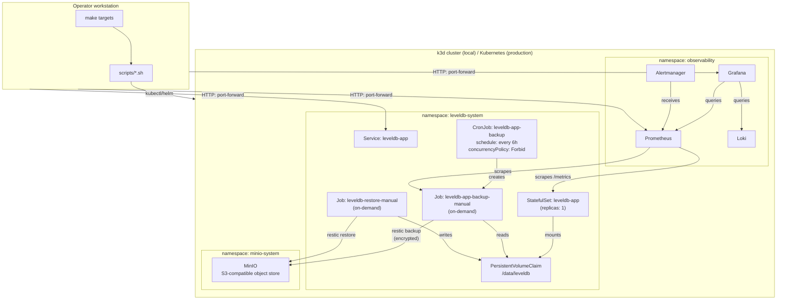

# Architecture

This document describes the system design of `stateful-k8s-recovery-lab`, explains the component relationships, and captures the rationale for major structural decisions.

---

## System overview

The system consists of four layers:

1. **Application layer** — a Go HTTP key-value service backed by embedded LevelDB storage, deployed as a Kubernetes `StatefulSet`
2. **Backup layer** — a Restic-based backup `CronJob` that writes encrypted snapshots to MinIO
3. **Observability layer** — Prometheus, Grafana, Alertmanager, and Loki
4. **Operator layer** — a Makefile and shell scripts that drive the entire lifecycle

---

## Component inventory

| Component | Namespace / Location | Type | Purpose |
|---|---|---|---|
| `leveldb-app` | `leveldb-system` | Go HTTP service | API-only key-value app backed by LevelDB |
| `leveldb-app` | `leveldb-system` | StatefulSet | Runs the single active writer pod for the LevelDB dataset |
| `data-leveldb-app-0` | `leveldb-system` | PVC | Stores `/data/leveldb` for the app pod |
| `leveldb-app` | `leveldb-system` | Service | Stable in-cluster endpoint for the app API |
| `leveldb-app-backup` | `leveldb-system` | CronJob | Runs Restic backup every six hours |
| `leveldb-app-backup-manual-*` | `leveldb-system` | Job | One-off backup created by `make backup` from the CronJob spec |
| `leveldb-restore-manual-*` | `leveldb-system` | Job | One-off restore job created by `make restore` |
| `leveldb-app-restic` | `leveldb-system` | Secret | Stores local-demo Restic and MinIO credentials |
| `minio` | `minio-system` | Helm release / Deployment | Local S3-compatible object storage for the POC |
| `restic` bucket | MinIO | Object bucket | Stores encrypted Restic repository data |
| `kube-prometheus-stack` | `observability` | Helm release | Installs Prometheus, Grafana, Alertmanager, and CRDs |
| `loki` | `observability` | Helm release | Stores Kubernetes logs |
| `promtail` | `observability` | Helm release | Collects pod logs and sends them to Loki |
| `ServiceMonitor` | `leveldb-system` | Prometheus Operator CRD | Tells Prometheus to scrape `/metrics` from the app |
| `PrometheusRule` | `leveldb-system` | Prometheus Operator CRD | Defines app and backup alerts |
| `Makefile` | repo root | Operator interface | Human-friendly command entry point |
| `scripts/*.sh` | repo root | Shell automation | Idempotent lifecycle, deploy, backup, restore, and diagnostics |
| `helm-values/*` | repo root | Helm values | Local values for MinIO, Prometheus stack, Loki, and Promtail |

---

## Architecture diagram



---

## Components

### Go application (leveldb-app)

A minimal Go HTTP service. It exposes a key-value API backed by LevelDB. There is no query language, no authentication, and no network replication—deliberately, to keep the operational model simple.

**Rationale for LevelDB:** LevelDB is an embedded key-value store with no network protocol and no daemon. It is appropriate for this reference because it forces explicit decisions about consistency, backup, and scaling that a distributed database (Cassandra, Redis Cluster) would obscure. The design decisions here generalize to any single-writer embedded store.

**Rationale for StatefulSet (not Deployment):** `StatefulSet` provides a stable pod identity and stable PVC binding. This means the pod always reconnects to the same volume after a restart. A `Deployment` with a `PVC` would work for a single replica, but `StatefulSet` is the idiomatic Kubernetes resource for stateful workloads and enables future per-pod sharding.

### Persistent storage

Each `leveldb-app` pod has exactly one `PVC`. The PVC is bound to the pod's stable identity (`leveldb-app-0`) by the `StatefulSet` `volumeClaimTemplates`. The storage class is the k3d default for local use; in production, use a storage class that supports volume expansion.

**Rationale for PVC-per-pod:** LevelDB holds an exclusive write lock on its data directory. Sharing one `ReadWriteMany` volume between pods would not fix this - LevelDB would still crash the second writer. PVC-per-pod reflects the actual constraint.

### Backup (Restic + MinIO)

Restic reads the LevelDB data directory and uploads an encrypted, deduplicated snapshot to a MinIO bucket. MinIO acts as a local S3-compatible backend.

**Rationale for Restic:** Restic handles encryption, deduplication, and incremental snapshots natively. The backup cost of a 6-hour interval on a multi-gigabyte dataset is bounded by the change volume, not the total dataset size. The Restic repository password is stored in a Kubernetes Secret; the repository is useless without this password.

**Rationale for 6-hour CronJob interval:** This sets a six-hour RPO target. Six hours is aggressive enough to limit data loss in most scenarios while being conservative enough to avoid backup jobs overlapping with peak write activity. The interval is configurable via Helm values.

**Rationale for `concurrencyPolicy: Forbid`:** Restic uses repository-level locking, so two concurrent Restic processes will contend on that lock — one will fail or stall.
Beyond the lock, overlapping Jobs create compounding problems: confusing backup status (which snapshot is authoritative?), extra I/O pressure on the PVC, potential PVC or snapshot contention, and doubled object-store bandwidth at the same time. `concurrencyPolicy: Forbid` keeps backup execution predictable: one Job runs, completes, and either succeeds or fails cleanly.
If a Job takes longer than the schedule interval (e.g., the first backup of a large dataset), the next scheduled run is simply skipped rather than stacked on top of the in-progress one.

**Consistency boundary (local POC vs. production):**

In the **local POC**, Restic reads the live-mounted LevelDB directory directly. LevelDB writes are not paused during the backup. For a development demo with small datasets, the risk is acceptable becuase catching a torn write is low and the purpose is to exercise the operational workflow.

In **production**, do not back up a live LevelDB directory for datasets where consistency matters. The recommended approach:

1. Use LVM to snapshot the underlying logical volume (`lvcreate --snapshot`)
2. Mount the snapshot read-only
3. Run Restic against the snapshot mount
4. Unmount and delete the snapshot after Restic completes

LVM snapshots are copy-on-write and near-instantaneous. The production backup Job spec should include these steps.

### MinIO

MinIO runs as a Helm-deployed service inside the cluster. For local POC, data persists only as long as the MinIO PVC exists. For production, MinIO should be replaced with or backed by durable external object storage (AWS S3, GCS, Azure Blob).

**Rationale for MinIO in the local POC:** For the POC, the important part is proving the backup and restore flow end to end, not proving a specific cloud provider integration. MinIO gives us a local S3-compatible target, so the same Restic workflow can be demonstrated without cloud credentials.

### Observability

- **Prometheus** scrapes `/metrics` from the app pod and from backup Job annotations. It evaluates alert rules.
- **Grafana** provides dashboards backed by Prometheus and Loki data sources.
- **Alertmanager** routes Prometheus alerts. In local use, alerts are visible in the Alertmanager UI. In production, configure routing to PagerDuty, Opsgenie, or a webhook.
- **Loki** collects logs from the app pod and backup/restore Jobs. Grafana queries Loki for log correlation.

**Rationale for including full observability in a POC:** Backup and restore workflows are high-stakes. The decision to use Alertmanager alerts for backup failures and CronJob suspension is deliberate — operators should not rely on manual checking of Job status. Observability is not a later stage; it is part of the design.

---

## Scaling model

LevelDB does not support concurrent writers. The following scaling options are safe:

| Model | Description | When to use |
|---|---|---|
| Vertical scaling | Increase pod CPU and memory | First response to throughput limits |
| Shard-per-pod | Each pod owns a disjoint key range | When total dataset or write rate exceeds one pod |
| Tenant partitioning | Each tenant gets its own StatefulSet+PVC | Multi-tenant use case |
| Read replicas | Copy-on-write snapshot served by a second pod | Only if the application explicitly supports quiescent snapshots |

**Do not use HPA with `replicas > 1` on a single LevelDB dataset.** LevelDB is embedded local storage with a single-writer model. A second writer will normally fail to acquire the database lock, and bypassing that protection can risk corruption.

The `StatefulSet` is intentionally fixed at `replicas: 1`, and the Helm chart does not expose a `replicaCount` value for the write path. This protects the normal Helm workflow from accidentally creating multiple writers for one dataset.

This is a chart-level guardrail, not a cluster-wide policy. A cluster administrator could still scale the StatefulSet manually with `kubectl`. In production, enforce this with an admission policy such as Kyverno, Gatekeeper, or Kubernetes `ValidatingAdmissionPolicy` if the invariant must be protected at the cluster level.

---

## Data flow: write path

```
Client → Service → leveldb-app-0 pod → LevelDB (/data/leveldb on PVC)
```

---

## Data flow: backup path

```
CronJob fires → backup Job pod → mounts PVC (read) → Restic → MinIO bucket
```

In production with LVM:

```
CronJob fires → backup Job pod → lvcreate snapshot → mount snapshot → Restic → MinIO → unmount → lvremove snapshot
```

---

## Data flow: restore path

```
Operator: make restore
→ suspend CronJob
→ exit if a backup Job is active (rerun after it finishes, or FORCE=1)
→ scale StatefulSet to 0
→ restore Job pod → mounts PVC (write) → Restic restore from MinIO
→ verify
→ scale StatefulSet to 1
→ resume CronJob
```

---

## Security boundaries

| Boundary | Mechanism |
|---|---|
| Restic repository | Encrypted with AES-256 using the repository password |
| MinIO credentials | Stored in Kubernetes Secret, injected as env vars |
| App service account | No cluster-wide RBAC; namespace-scoped only |
| Backup Job service account | Permission to read/write Secrets (for Restic password) only |
| Container users | Non-root for all containers (UID 1000 for both app and backup) |
| Network | NetworkPolicies restrict inter-namespace traffic (production hardening) |

---

## RPO and RTO

**RPO (Recovery Point Objective):** Six hours. This is the maximum age of the most recent successful Restic snapshot. If the system is running correctly, restoring the latest snapshot loses at most six hours of writes.

**RTO (Recovery Time Objective):** Not bounded by this design. Restoring a 2 TB dataset from MinIO depends on I/O throughput. At 200 MB/s (a reasonable SSD read rate), restoring 2 TB takes approximately 3 hours. Network transfer from remote object storage adds to this. Plan and test RTO separately for each production deployment.

The RPO target is enforced by the CronJob schedule and by the `LevelDBBackupNotRunRecently` Prometheus alert (fires if no successful backup in 8 hours).

---

## Local POC vs. production differences

| Concern | Local POC | Production |
|---|---|---|
| Cluster | k3d (Docker) | Managed Kubernetes (EKS, GKE, AKS) or bare metal |
| Object storage | MinIO in-cluster | S3, GCS, or Azure Blob |
| Backup consistency | Live directory | LVM snapshot |
| Secrets | Kubernetes Secret from `.env` | External Secrets Operator + KMS |
| Storage class | k3d default (local-path) | Cloud block storage with expansion support |
| Dataset size | Megabytes (demo) | Up to 2 TB per pod |
| NetworkPolicies | Not enforced | Required |
| TLS | Not configured | Required for all inter-service communication |

---

## Glossary

| Term | Meaning |
|---|---|
| StatefulSet | Kubernetes workload type that provides stable pod identity and stable storage attachment. Used here because the app owns persistent local state. |
| PVC | PersistentVolumeClaim. A Kubernetes request for persistent storage. The app stores LevelDB data on a PVC mounted at `/data`. |
| LevelDB | Embedded key-value database. It runs inside the app process and is not a networked database server. |
| Single writer | Only one process should write to one LevelDB dataset at a time. This is the core scaling constraint in the design. |
| RPO | Recovery Point Objective. Maximum acceptable age of the latest recoverable backup. This design targets six hours. |
| RTO | Recovery Time Objective. How long restore takes. This design documents it but does not guarantee a fixed RTO. |
| Restic | Backup tool used to create encrypted, deduplicated snapshots of the LevelDB data directory. |
| Snapshot | A point-in-time backup record in Restic. In production, the backup source should be an LVM or CSI snapshot, not a live mutable directory. |
| MinIO | Local S3-compatible object storage used by the POC as the Restic backend. |
| LVM snapshot | Copy-on-write snapshot of a logical volume. Recommended production consistency boundary before Restic reads data. |
| CronJob | Kubernetes resource that runs Jobs on a schedule. Used for six-hour backups. |
| Job | Kubernetes resource that runs a finite task to completion. Used for manual backup and restore. |
| ServiceMonitor | Prometheus Operator resource that tells Prometheus how to scrape app metrics. |
| PrometheusRule | Prometheus Operator resource that defines alerting rules. |
| Loki | Log aggregation system used by Grafana to query Kubernetes logs. |
| Promtail | Agent that collects pod logs and sends them to Loki. |
| HPA | HorizontalPodAutoscaler. Not safe for scaling one LevelDB dataset because it would create multiple writer pods. |
| Shard-per-pod | Safe scaling model where each pod owns a different dataset or key range. |
| Admission policy | Kubernetes policy that can reject unsafe changes, such as scaling the LevelDB StatefulSet above one replica. |